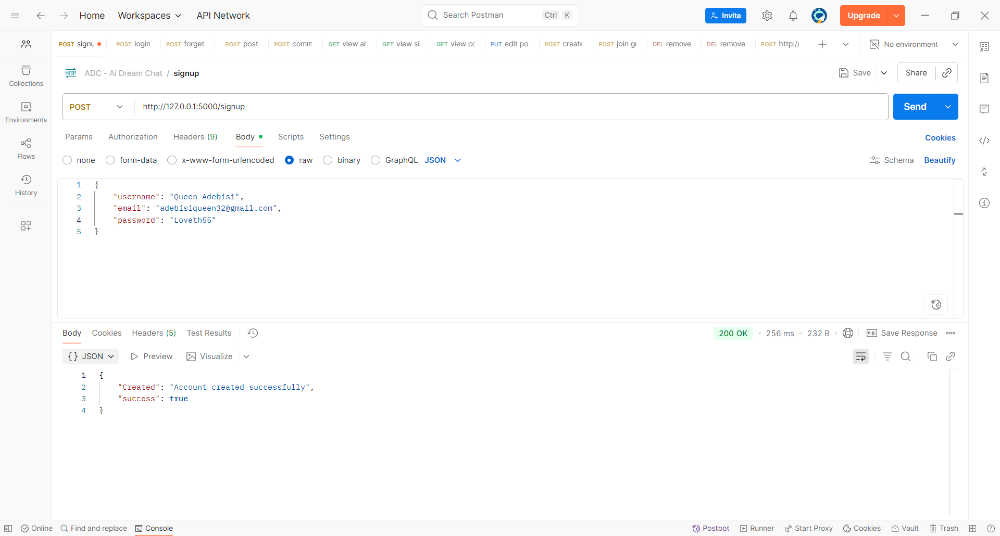
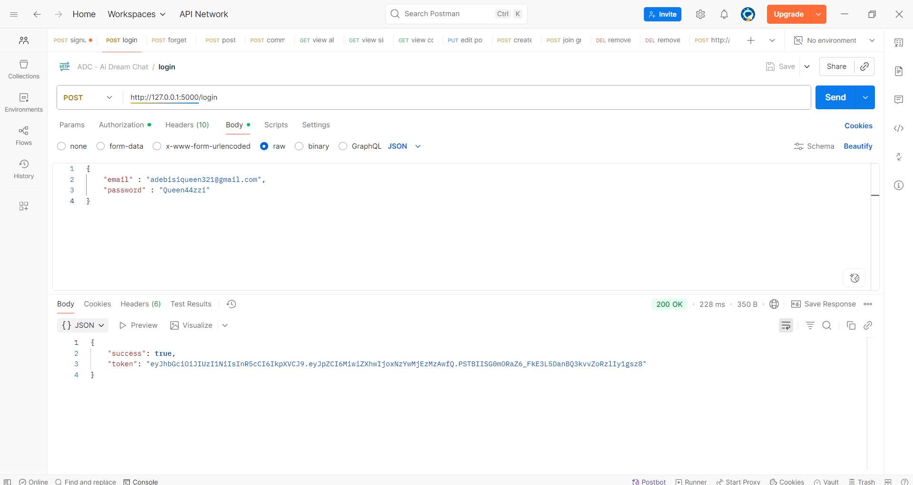
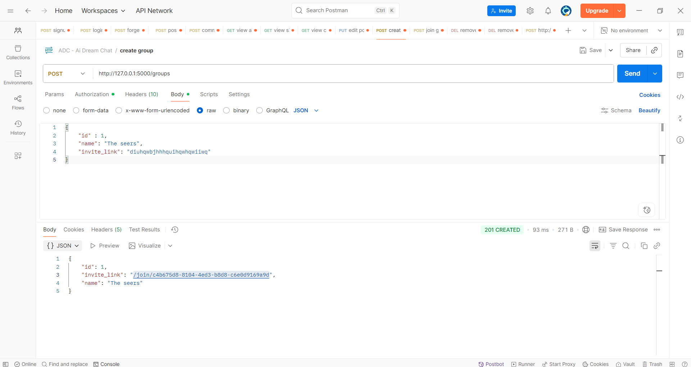
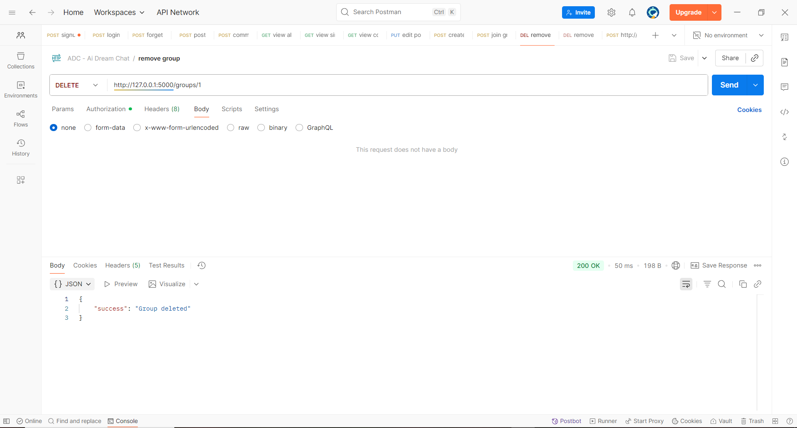
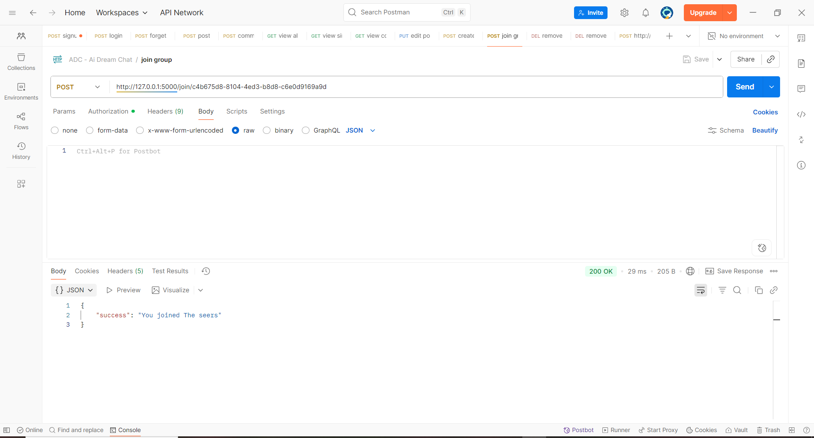
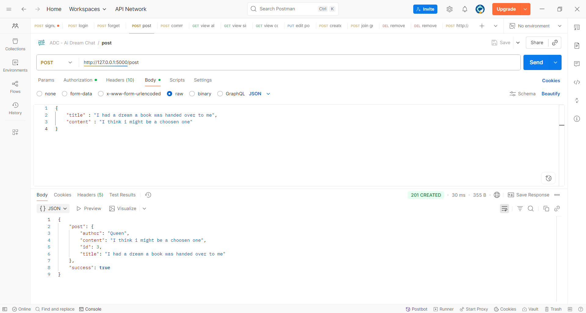
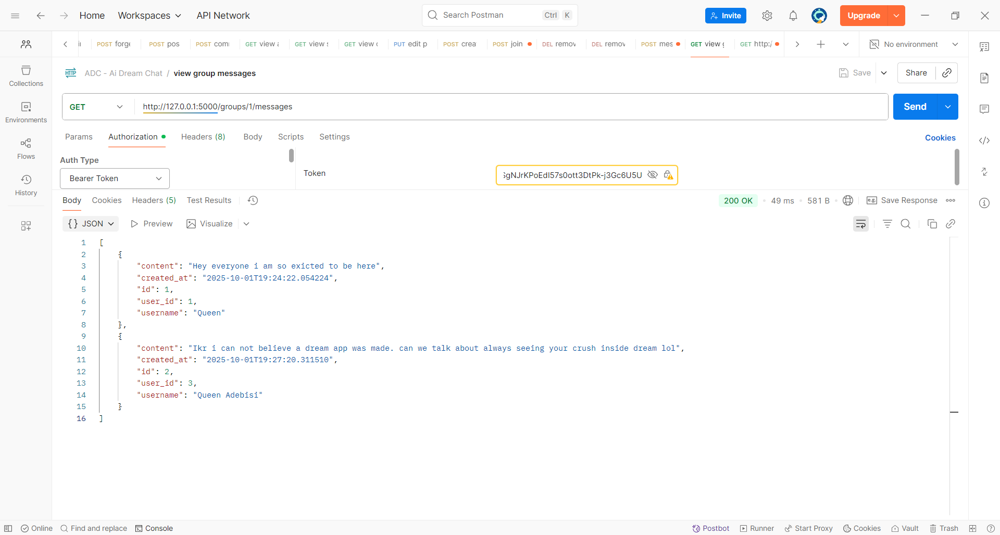
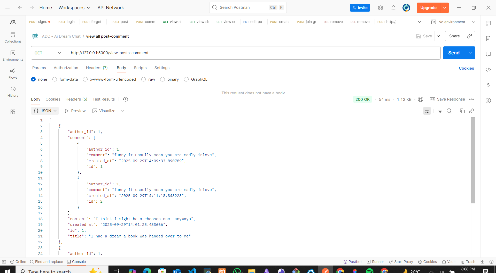

# ADC - Ai Dream Chat
A unique real-time platform where users can post about their dreams, share interpretations, and connect through comments  all while staying anonymous.  
No profile pictures, no flashy bios just raw conversations. Users can also choose to repost the AI’s deep cultural analysis of their dream so others can learn what it means in different traditions and societies.  

Built from scratch with a Python backend and modern frontend tools.  

---
## 📖 Documentation
- [API Docs](ADC-documentation.json)
- [WebSocket Docs](docs/websocket.md)

## 🌟 Features

- User authentication (sign up, login, JWT tokens)  
- Post dreams & add comments  
- Create chat groups, invite via unique link, add/remove users
- Share dreams and get comments from other users
- AI-powered dream interpretation that explores meanings in your own culture and across others
- Option to repost AI interpretations for the community to learn from
- Real-time messaging with WebSockets  
- Time-based edit restrictions (e.g., you can edit a post only within 3 hours)  
- Anonymous by design no profile photo or personal bios collected
-  Clean, distraction-free frontend UI  

---

## 🧰 Tech Stack

| Component        | Technology / Library      |
|------------------|---------------------------|
| Backend          | Python, Flask             |
| DB & Migrations  | SQLAlchemy, Flask-Migrate |
| Real-time        | Flask-SocketIO            |
| Authentication   | JWT, Flask-HTTPAuth        |
| Dev / Production DB | SQLite (dev), Postgres (prod) |

---

## 🚀 Installation & Setup

# bash
git clone https://github.com/Syntax-Queen/ADC-Backend.git

cd ADC-Backend

python -m venv .venv

.venv/bin/activate         # or Windows: .venv\Scripts\activate

pip install -r requirements.txt

# Setup your config (e.g. SECRET_KEY, database URI) in `config.py` or via env vars

flask db migrate -m "Initial migration"
flask db upgrade

# Run with WebSocket support
python app.py               # or flask run if you wire socketio.run in your entry

---

## 📸 Screenshots

### 🔑 Authentication

### 👥 Group Management

### 💬 Messaging

---
# Project Layout

├── app.py
├── auth.py
├── config.py
├── models.py
├── routes/
│   └── user.py
├── migrations/
├── requirements.txt
└── docs/
    └── screenshots/
